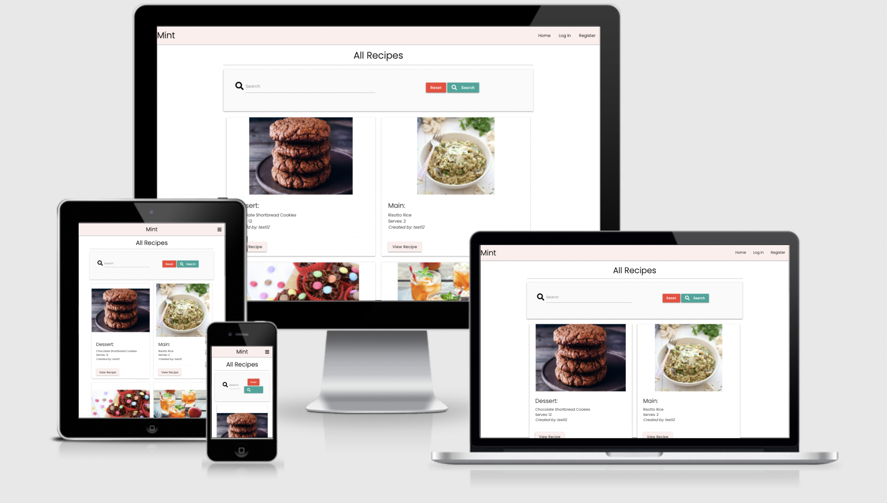

# Primerose Cottage

[View the deployed website](https://ms3-cc-mint.herokuapp.com/)

## Table of Content 
1. [Project Goals](#project-goals)
2. [User Experience](#user-experience)
    1. [User Stories](#user-stories)
    2. [Design choices](#design-choices)
    3. [Fonts](#fonts)
    4. [Colours](#colours)
    5. [Wireframes](#wireframes)
3. [Features](#features)
    1. [Existing Features](#existing-features)
    2. [Features left to Implement](features-left-to-implement)
4. [Technologies Used](#technologies-used)
5. [Testing](#testing)
    1. [HTML Validation](#html-validation)
    2. [CSS Validation](#css-validation)
    3. [Accessibility](#accessibility)
    4. [Performance](#performance)
    5. [Javascript](#javascript)
    6. [Python](#python)
    7. [Testing client stories from UX section](#testing-client-stories-from-ux-section)
6. [Bugs](#bugs)
7. [Deployment](#deployment)
8. [How to run this project locally](#how-to-run-this-project-locally)
9. [Credits](#credits)
    1. [HTML](#html)
    2. [CSS](#css)
    3. [Javascript](#javascript)
    4. [Python](#python)
    4. [Media](#media)
    5. [Text](#text)
    6. [Acknowledgements](#acknowledgements)

## Project Goals
My primary goal for Mint to allow users to upload, edit and view other users recipes. I want their experiene to be userfriendly. My target audience will be home cooks between the ages of 25-55 year olds.

My user goals are:
1. The website to user-friendly
2. Visually appealing leaving visites wanting to come back for me.
3. The website to inspire users to cook and use this website to store their recipes.
4. The ability to add and delete recipes. 

Mint website will meet users needs by:
1. The wesite is responsive and easy to navigate through.
2. The website uses a subtle pink through, keeping it consistent with the recipes displaying clearly and effectively.
3. The website is easy to use and users are able to easily upload images and view other peoples recipes.
4. Users are able to add and delete recipes effiently.

### Developer and Business Goals
1. Create a professional website which is userfriendly, innovative and stylish.
2. User MongoDB effectively.
3. To add this to my portfolio and be proud of the work I have created.
4. All pages to be functioning properly 
5. The site to be fully responsive.

## User Experience
### User Stories 

#### Site Users
1. The ability to easily use and navigate the website.
2. All recipes to be displaying effectively and is userfriendly.
3. A functioning main menu button which adapts to whether the user is logged in or not.
4. Visual icons and images that suit the website.
5. MongoDB to store data safely and effectively.
6. Leaves users to wanting follow other users recipes and gain inspiration to cook. 
7. Leaves users wanting to add more of their recipes onto the website.
8. Users to enjoy visiting the website.

#### Site Owner 
9. As the site owner I want the customers to easily navigate the website.
10. As the site owner I want all data inputted into the website, such as passwords, to be stored safely.
11. As the site owner I want users coming back to use the site for inspiration or to have an easily accessible way of storing their recipes.
12. As the site owner I want my websit to be fully functioning and responsive.
13. As the site owner, I want the website to suit my target customer and adhere to their wants and needs.
14. As the site owner, I want the website to be professional.

### Design choices 
I designed this website to have a light pink theme to draw in my target customers. The colour is not too overpowering and leaves the recipes the center of attention on the page. 
I want the recipes to be the star of the show and everything else to be easy to read, use and works well. 

### Images 
The images on the recipes section of website are of recipes to show clearly what the recipe is at one glance, this works well for this particular website. 
The images on the utensils page are of products recommended for cooking. 

### Wireframes 
* [Recipes](static/wireframes/home.png)
* [Login](static/wireframes/login.png)
* [Register](static/wireframes/register.png)
* [Recipe](static/wireframes/recipe.png)
* [Profile](static/wireframes/profile.png)
* [Add Recipe](static/wireframes/addrecipe.png)
* [Utensils](static/wireframes/utensils.png)
* [Utensil](static/wireframes/utensil.png)
* [Edit Recipe](static/wireframes/editrecipe.png)
* [Categories](static/wireframes/categories.png)
* [Add Category](static/wireframes/addcategory.png)

## Technologies Used 
* [Google Fonts](https://https://fonts.google.com/) has been used for my fonts.
* [Font awesome](https://fontawesome.com/) has been used throughout my wesbite.
* [Materialize](https://materializecss.com/) has been used to help create the layout of this website.
* [GitHub](https://github.com/) used as primary for my code.
* [Balsamiq](https://balsamiq.com/) used to create wireframes.
* [Fask](https://flask.palletsprojects.com/en/2.0.x/) Used flask as a framework
* [MongoDB](https://www.mongodb.com/) used to store data.
* [Favicon](https://favicon.io/) used to my favicon.

## Features
### Existing Features 
* The website will open displaying the Home, Login and Register page.
* Once the user has logged in or registered they are able to view all pages.
* The homeapge shows all recispes added by all users.
* If the user created a recipe, there is edit or delete functionality which will only appear on their recipes.
* The recipes have a 'view recipe' button which allows the user to select and be taken through to view the recipe.
* The use is able to search for recipes.
* Add recipe page is somewhere a user can go to add a recipe.
* The profile page pull through a list of recipes the user created.
* The use is able to search for recipes.
* There is a utensils page which the user if added these will be able to edit and delete.
* The utenisls have a button 'view utensil' which will take the user through to see utensil information.
* The use is able to search for utensils.
* The add utensisl page allows users to add utensils to the utensils page.
* The categories page is only visible to the 'admin' user. This displays a list of all categories and the admin can add, edit and delete the categories.
* Pressing logout will log the user out on the menu bar will.

### Features left to implements
* I would like users to to able to upload images from their phone or computer instead of inserting a URL.
* I would like each recipe to have a comment section.
* I would like to add link to social media page for the website.

## Testing
### HTML Validation
The [W3C Markup Validator Service](https://validator.w3.org/) was used to validate the HTML of the website. All pages have no errors. 
Click on the page to see the results:
[Recipes](static/testing/htmlhome.png)
[Recipe](static/testing/htmlrecipe.png)
[Add Recipe](static/testing/htmladdrecipe.png)
[Edit Recipe](static/testing/htmleditrecipe.png)
[Profile](static/testing/htmlprofile.png), this has to be inputted using code as the url could not be checked.
[Utensils](static/testing/htmlutensils.png)
[Utensil](static/testing/htmlutensil.png)
[Add Utensil](static/testing/htmladdutensil.png)
[Login](static/testing/htmlhome.png)
[Edit Utensil](static/testing/htmleditutensil.png)
[Register](static/testing/htmlregister.png)
[Categories](static/testing/htmlcategories.png)
[Add Category](static/testing/htmladdcategory.png)
[Edit Category](static/testing/htmleditcategory.png)

### CSS Validation
The [W3C Validator Service](https://jigsaw.w3.org/css-validator/#validate_by_uri) was used to validate the CSS of the website.
The CSS passed with no errors, click [here](static/testing/css.png) to see evidence.

### Performance 
[Google lighthouse](https://developers.google.com/web/tools/lighthouse) was used to test the performance, accessibility, best practices and SEO of the website. I am really happy with the outcome of this test select  [here](static/testing/lighthouse.png) to see evidence. 

### Javascript
[JS Hint](https://jshint.com/) was used to test the Javascript code. Passed with zero errors select [here](static/testing/js.png) for evidence.

### Python
[Pep 8](http://pep8online.com/) used to check for errors. No errors occurred in the code, the only errors and warning are from comments. See [here](static/testing/pep8.png) for evidence.

### Testing client stories from UX section 

#### Site Users
1. The ability to easily use and navigate the website.
| Feature                  | Action                                    | Expected result                                   | Actual result     |
|--------------------------|-------------------------------------------|---------------------------------------------------|-------------------|
| Fully respsonvie nav bar | Click on which page would like to display | Navr bar will take the user to their desired page | Works as expected |
|                          |                                           |                                                   |                   |

    1. Select  to see evidence. 

2. All recipes to be displaying effectively and is userfriendly.
    | Feature                                                                             | Action                                                                              | Expected result                                                      | Actual result     |
|-------------------------------------------------------------------------------------|-------------------------------------------------------------------------------------|----------------------------------------------------------------------|-------------------|
| All recipes appear on the recipe.html (home) page with all information              | Recipes to display on the recipe.html (home page) and be responsive                 | All recipes are displayed clearly with images and view recipe button | Works as expected |
| The recipes have the functionality to edit and delete recipes if you are the owner. | If user creates the recipes edit and delete buttons will appear next to the recipe  | Users to be able to edit and delete recipes added.                   | Works as expected |

1. Select  to see evidence. 

3. A functioning main menu button which adapts to whether the user is logged in or not.
    1. The menu bar shows, home, login and register when a user first enters the site.
    2. Login page as a link to the register page if they do not have an account.
    3. Register page has a link to the login page if they already have an account.
    4. Once logged in or registered the menu bar shows all options including utensils, add recipe and profile page.

4. Visual icons and images that suit the website.
    1. The website is a subtle pink which does not over power the website leaving users focussing soley on the recipes and the contents of the site.
    2. The images on the website are URLs of the recipes which suit the contents and on the utensils page.

5. MongoDB to store data safely and effectively.
    1. All data is stores safely and effectively on mongoDB.

6. Leaves users to wanting follow other users recipes and gain inspiration to cook. 
    1. I believe the site will leave users happy and engaged because it is very user friendly and is easy to search for recipes. 

7. Leaves users wanting to add more of their recipes onto the website.
    1. The website is very user friendly which would make it a good place for users to store their recipes for easy access to them when cooking. 

8. Users to enjoy visiting the website.
    1. I believe this website could entice anyone to get into cooking or baking.
    2. Hopefully users will come back for me.

#### Site Owner 
9. As the site owner I want the customers to easily navigate the website.
    1. The site is very easy to navigate especially with the fixed nav bar meaning users can get to different pages of the website easily.
    2. Each page is clearly labelled.
    3. All pages are fully responsive. 

10. As the site owner I want all data inputted into the website, such as passwords, to be stored safely.
    1. All passwords and information are stored safely on mongoDB 

11. As the site owner I want users coming back to use the site for inspiration or to have an easily accessible way of storing their recipes.
    1.  The website is very user friendly which would make it a good place for users to store their recipes for easy access to them when cooking. 

12. As the site owner I want my websit to be fully functioning and responsive.
    1. All pages are fully responsive and functioning. 

13. As the site owner, I want the website to suit my target customer and adhere to their wants and needs.
    1. I beleive the website suits my target audience.
    2. The name is a good fit too as it is called mint (the herb) which goes with the theme of recipes cooking and baking.

14. As the site owner, I want the website to be professional.
    1. I am pleased with the look and feel of this website. I beleive it feels professional and I hope users will think this too.

## Bugs found and fixed during development 
1. JavaScript dropdown menu did not work as expected, I used code from [Task Manager Auth Tutorial](https://github.com/Code-Institute-Solutions/TaskManagerAuth/blob/main/04-AddingATask-WritingToTheDatabase/02-materialize-select-validation/static/js/script.js) to fix this problem. 
2. Utensils Search Box was not working and displaying an error about `$text`. I forgot to add the text index to mongoDB utensils collection so this is why it was not working. 
3. On the recipes.html and utensils.html page, the card containers I was using from materialize were being distorted by the image sizes. I needed to adjust the image size but not have the images distorted so I used `object-fit: contain;` in CSS to fix this issue and added a height restriction. This worked well and now all the containers are equal sizes. 
4. Utensils page was not showing the delete / edit functionality if the user was logged in. Part of the issue was, I had not included the created by for utensils in mongoDB or in my profile page or added them to the edit, add or utensils section in mongoDB. After they were added I needed to amend a few html eliments and it worked.
5. Buttons on the search bar were not repsosnive. I added some CSS to make the buttons smaller as the screen sized got smaller.
6. The card sizes on my recipes.html page and utensils.html page were different sizes. I amended the images to ensure these were always a certain size without distorting the image.

## Deployment

### Requirements 
1. Python3 to run applications. 
2. Gitpod or another IDE of your choosing.
3. MongoDB Atlas account for database development.
4. PIP to instal all app requirements.

### How to run this project locally
1. Click the green clone or download button in [Github](https://github.com/carolinecole25/MS3_CC_recipes)
2. Select clipboard button on the right of the link provided.
3. In your terminal, type git clone, paste in the previously copies linke and enter.
4. Create a file .flaskenv and include `FLASK_APP=run.py` and `FLASK_ENV=deveopment`
5. Install the pip3 with the command `pip -r requirements.txt` in the terminal.
6. Create a free [MongoDB](https://cloud.mongodb.com/) account and create a database.
7. Create the below collections:
    1. categories 
        * _id: `<ObjectId>`
        * category_name: `<string>`
    2. recipes
        * _id: `<ObjectId>`
        * category_name: `<string>`
        * recipe_name: `<string>`
        * ingredients: `<string>`
        * serves: `<string>`
        * method: `<string>`
        * created_by: `<string>`
        * recipe_image: `<string>`
    3. users 
        * _id: `<ObjectId>`
        * username: `<string>`
        * password: `<string>`
    4. utensils
        * _id: `<ObjectId>`
        * utensil_name: `<string>`
        * utensil_description: `<string>`
        * utensil_details: `<string>`
        * utensil_image: `<string>`
        * untensil_created_by: `<string>`
8. You should now be able to run this application using flask run. 

### Deployment to Heroku
1. Create a requirements.txt file by `typing pip3 freeze --local > requirements.txt` into the terminal line.
2. Create a Procfile by typing `echo web: python app.py > Procile`.
3. `git add -A`, `git commit -m ""` and `git push` these changes.
4. Navigate to Heruko.
5. Create new app and give it a name.
6. Choose the region that is closest to you.
7. Go to Deploy tab and choose Github (if you are using).
8. Search the correct repsoitory and connect.
9. Go to Heroku settings and navigate to config vars and set the following:
    * IP = 0.0.0.0
    * MONGO_DBNAME = [Name of MongoDB]
    * MONGO_URI = `mongodb+srv://:@<cluster_name>-qtxun.mongodb.net <database_name>?retryWrites=true&w=majority `
    * PORT = 5000
    * SECRET_KEY = [Secret key]
10. Go to the Deploy tab and Deploy Branch, ensuring that the master branch is selected.

## Credits
### HTML
1. Code taken from [Code Institute, Task Manager](https://github.com/Code-Institute-Solutions/TaskManagerAuth/tree/main/08-SearchingWithinTheDatabase) tutorial videos to help with page layouts and linking pages for base.html, categories.html, add_category.html, add_recipe.html, edit_category.html, edit_recipe.html, login.html, register.html, profile.html, recipes.html. The video tutorials helped guide me through writing my code but adapting it to how I wanted my website to look. 
2. Pay layouts taken from [Materialize](https://materializecss.com/) and with colours and screen sizes.

### CSS
1. Some CSS code taken from [Code Institute, Task Manager](https://github.com/Code-Institute-Solutions/TaskManagerAuth/tree/main/08-SearchingWithinTheDatabase) module but more is for styling purposes. 

### Javascript
1. Code for sidenav, collaspible and formselect taken from [Materialize](https://materializecss.com/).
2. Code for select dropdown taken from [Task Manager Auth Tutorial](https://github.com/Code-Institute-Solutions/TaskManagerAuth/blob/main/04-AddingATask-WritingToTheDatabase/02-materialize-select-validation/static/js/script.js).

### Python 
1. Code for project taken from[Code Institute, Task Manager](https://github.com/Code-Institute-Solutions/TaskManagerAuth/tree/main/08-SearchingWithinTheDatabase) and edited to fit projects needs.
2. The code for ingredients I wanted to pull through as a list instead of a line of each. I used help from [Kite](https://www.kite.com/python/answers/how-to-get-the-split-a-string-with-a-jinja2-template-in-python) to fix this issue.
3. [Stack Over Flow](https://stackoverflow.com/questions/17662928/django-creating-a-custom-500-404-error-page) used to help me create the code for the 404 error page.
### Media
1. Images for recipes and Utensils taken from [Google images](https://www.google.co.uk/imghp?hl=en&ogbl) and opened in new tab to get the URL.

### Text 
1. Text for recipes taken from [BBC Food](https://www.bbc.co.uk/food).
2. Text for utensils taken from [Wikipedia](https://en.wikipedia.org/wiki/Main_Page).

### Acknowledgements 
1. Tutor Support has helped out with a few sticky issues by guiding my in the write direction. Finding out a bug / code issue is very satisfying and I was able to find a lot of problems myself without too much support.
2. Styling for my website is inspirated by [Sarah's Day](https://www.sarahsday.com/)
